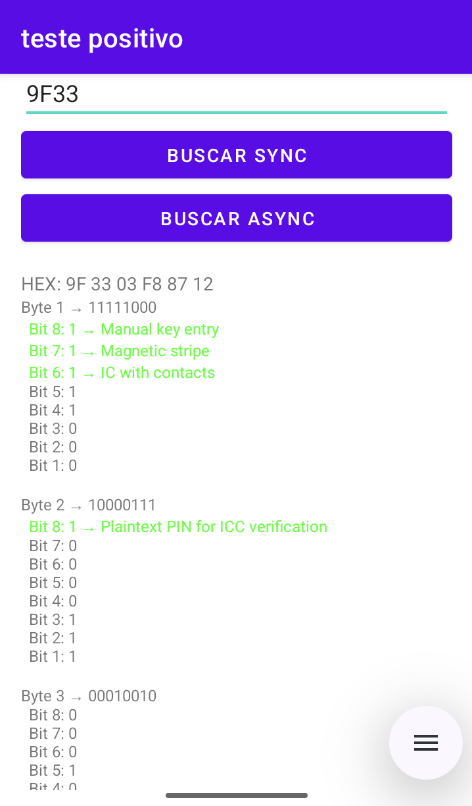

# EMV TLV Decoder

## Descrição

Esse projeto é a resolução do teste técnico proposto pela Positivo tecnologia. Consiste em um aplicativo Android desenvolvido para análise e decodificação de tags EMV. O app permite consultar, parsear e analisar dados de transações de cartão de crédito em formato TLV (Tag-Length-Value), oferecendo uma visão detalhada dos bits individuais e suas definições.

## O que o Projeto Faz

O aplicativo fornece as seguintes funcionalidades:

- **Consulta de Tags EMV**: Interface para buscar e recuperar informações de tags EMV específicas (ex: 9F33, 9F6C, 82, etc.)
- **Parsing TLV (Tag-Length-Value)**: Extração automática e validação de dados estruturados em formato hexadecimal
- **Análise de Bits**: Decodificação byte-a-byte e bit-a-bit com mapeamento para descrições semânticas
- **Conversão de Formato**: Transformação de dados hexadecimais em formatos legíveis
- **Modos de Busca**: Suporte para consultas síncronas e assíncronas



## Como Rodar o Projeto

### 1. **Clonar / Abrir o Projeto**

```bash
git clone https://github.com/matheusherman/EMV-TLV-decoder
```

Abra o projeto em Android Studio:
```bash
cd AndroidStudioProjects/testepositivo
open . -a "Android Studio"
```

### 2. **Instalar Dependências**

O Gradle instalará automaticamente todas as dependências ao fazer sync:
- Abra o arquivo `build.gradle.kts`
- Clique em "Sync Now" na barra de ferramentas de notificação do Android Studio

É necessário copiar o arquivo da biblioteca ```emv_lib-1.0-debug.aar``` para dentro da pasta ```app/libs/```

> [!NOTE]
> O arquivo da biblioteca não está disponível no repositório

### 3. **Executar o Aplicativo**

**Opção A - Emulador:**
- Abra o Android Virtual Device (AVD) Manager
- Crie ou inicie um emulador (API 24+)
- Pressione `Run` ou use: `Ctrl+R` (Windows/Linux) ou `Control+R` (Mac)

**Opção B - Dispositivo Físico:**
- Conecte um dispositivo Android via USB
- Ative o modo "Developer" nas configurações do dispositivo
- Pressione `Run` no Android Studio

### 4. **Usar a Aplicação**

1. Inicie o aplicativo
2. Digite uma tag EMV (exemplo: `9F33`, `82`, `95`)
3. Escolha entre busca **Síncrona** ou **Assíncrona**
4. Visualize os dados em formato hexadecimal
5. Analise os bits decodificados com suas descrições semânticas

## Estrutura do Projeto

```
app/
├── src/main/java/com/example/testepositivo/
│   ├── MainActivity.java            # Interface principal
│   ├── EmvService.java              # Serviço de acesso à EMV
│   ├── TLVParser.java               # Parser de dados TLV
│   ├── BitAnalyzer.java             # Analisador de bits
│   ├── model/                       # Classes de modelo
│   └── repository/                  # Repositório de tags
├── src/main/res/
│   └── layout/                      # Layouts XML
├── libs/
│   └── emv_lib-1.0-debug.aar        # Biblioteca EMV Positivo
└── build.gradle.kts                 # Configuração do Gradle

```
